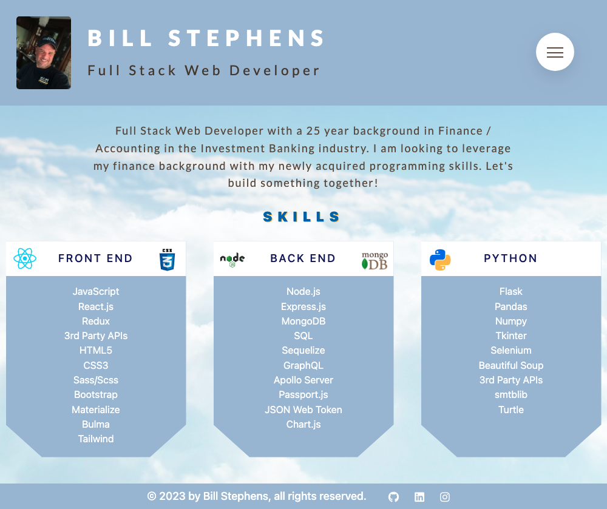

# Project-Portfolio 

  ## Description

  This is a web app built with REACT and custom CSS/SCSS to showcase my project portfolio.
  
  See screenshot below:
  

  ## Table of Contents
  
  - [Installation](#installation)
  - [Usage](#usage)
  - [License](#license)
  - [Contributing](#contributing)
  - [Tests](#tests)
  - [Questions](#questions)
  
  ## Installation
  
  deployed app URL:  https://billstephens2022.github.io/my_portfolio/
  
  ## Usage
  
  go to the URL above and navigate to Portfolio page to see my projects

  ## License
This application is covered under the MIT License.
 For more information: https://opensource.org/licenses/MIT
  
  ## Contributing
  N/A
  
  ## Tests
  N/A

  ## Questions
  Contact Info 
  GitHub user name: BillStephens2022 
  Link to GitHub profile: https://github.com/BillStephens2022 
  Email: stephensbill17@gmail.com
